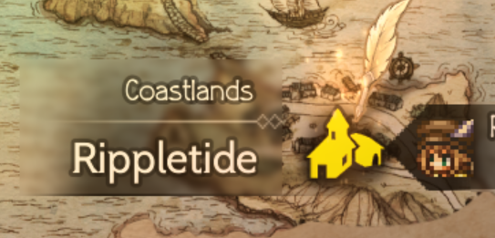

### Coastlands

<table style="border-collapse: collapse; width: 100%; margin: 16px 0; font-family: inherit;">
  <tr>
    <th style="width: 50%; text-align: center; background-color: #f8f9fa; padding: 12px 16px; border: 1px solid #e9ecef; font-size: 1.1em;">地点示意</th>
    <th style="text-align: center; background-color: #f8f9fa; padding: 12px 16px; border: 1px solid #e9ecef; font-size: 1.1em;">地点说明</th>
  </tr>
  <tr>
    <td style="text-align: center; vertical-align: middle; padding: 16px; border: 1px solid #e9ecef;">
      
    </td>
    <td style="text-align: center; vertical-align: middle; padding: 16px; border: 1px solid #e9ecef; line-height: 2;">
      <strong>所属区域</strong>：Coastlands 
      <strong>城镇名称</strong>：Rippletide
    </td>
  </tr>
  <tr>
    <td colspan="2" style="background-color: #f8f9fa; padding: 12px 16px; border: 1px solid #e9ecef; font-size: 1.1em; font-weight: bold;">
      详情说明
    </td>
  </tr>
  <tr>
    <td colspan="2" style="padding: 16px; border: 1px solid #e9ecef; line-height: 1.7;">
      <strong>宝箱完成情况</strong> <input type="checkbox"  style="vertical-align: middle; margin-right: 8px;">🔮 紫色宝箱：1 个 <input type="checkbox" checked style="vertical-align: middle; margin-right: 8px;">👑 金色宝箱：3 个 <input type="checkbox" checked style="vertical-align: middle; margin-right: 8px;">🥈 银色宝箱：5 个  <strong>未获取道具</strong> <input type="checkbox"  style="vertical-align: middle; margin-right: 8px;">📦 生锈的短剑 <input type="checkbox" checked style="vertical-align: middle; margin-right: 8px;">📦 冒险家的藏宝图 <input type="checkbox"  style="vertical-align: middle; margin-right: 8px;">📦 幸运铜护符 <input type="checkbox"  style="vertical-align: middle; margin-right: 8px;">📦 港口商店折扣券
    </td>
  </tr>
</table>

<table style="border-collapse: collapse; width: 100%; margin: 16px 0; font-family: inherit;">
  <tr>
    <th style="width: 50%; text-align: center; background-color: #f8f9fa; padding: 12px 16px; border: 1px solid #e9ecef; font-size: 1.1em;">地点示意</th>
    <th style="text-align: center; background-color: #f8f9fa; padding: 12px 16px; border: 1px solid #e9ecef; font-size: 1.1em;">地点说明</th>
  </tr>
  <tr>
    <td style="text-align: center; vertical-align: middle; padding: 16px; border: 1px solid #e9ecef;">
      
    </td>
    <td style="text-align: center; vertical-align: middle; padding: 16px; border: 1px solid #e9ecef; line-height: 2;">
      <strong>所属区域</strong>：Coastlands 
      <strong>城镇名称</strong>：Path to the Caves of Maiya
    </td>
  </tr>
  <tr>
    <td colspan="2" style="background-color: #f8f9fa; padding: 12px 16px; border: 1px solid #e9ecef; font-size: 1.1em; font-weight: bold;">
      详情说明
    </td>
  </tr>
  <tr>
    <td colspan="2" style="padding: 16px; border: 1px solid #e9ecef; line-height: 1.7;">
      <strong>宝箱完成情况</strong> <input type="checkbox"  style="vertical-align: middle; margin-right: 8px;">🔮 紫色宝箱：1 个 <input type="checkbox" checked style="vertical-align: middle; margin-right: 8px;">👑 金色宝箱：3 个 <input type="checkbox" checked style="vertical-align: middle; margin-right: 8px;">🥈 银色宝箱：5 个  <strong>未获取道具</strong> <input type="checkbox"  style="vertical-align: middle; margin-right: 8px;">📦 生锈的短剑 <input type="checkbox" checked style="vertical-align: middle; margin-right: 8px;">📦 冒险家的藏宝图 <input type="checkbox"  style="vertical-align: middle; margin-right: 8px;">📦 幸运铜护符 <input type="checkbox"  style="vertical-align: middle; margin-right: 8px;">📦 港口商店折扣券  <strong>怪物情况</strong> <input type="checkbox" checked style="vertical-align: middle; margin-right: 8px;">👾 behemoth  <strong>生词词汇</strong><table style="width: 100%; border-collapse: collapse; margin-top: 8px;">
  <tr>
    <th style="width: 50%; text-align: left; background-color: #f8f9fa; padding: 8px 10px; border-bottom: 1px solid #e9ecef; font-weight: 600;">单词</th>
    <th style="text-align: left; background-color: #f8f9fa; padding: 8px 10px; border-bottom: 1px solid #e9ecef; font-weight: 600;">释义</th>
  </tr>
  <tr>
    <td style="padding: 6px 10px; border-bottom: 1px solid #f0f2f5;"><strong>brim with treasures</strong></td>
    <td style="padding: 6px 10px; border-bottom: 1px solid #f0f2f5;">财宝遍地</td>
  </tr>  <tr>
    <td style="padding: 6px 10px; border-bottom: 1px solid #f0f2f5;"><strong>Leave it to me!</strong></td>
    <td style="padding: 6px 10px; border-bottom: 1px solid #f0f2f5;">包在我身上</td>
  </tr>  <tr>
    <td style="padding: 6px 10px; border-bottom: 1px solid #f0f2f5;"><strong>give a wide berth to sth/sb</strong></td>
    <td style="padding: 6px 10px; border-bottom: 1px solid #f0f2f5;">敬而远之，保持距离</td>
  </tr>  <tr>
    <td style="padding: 6px 10px; border-bottom: 1px solid #f0f2f5;"><strong>full-fledged,/ˌfʊl ˈfledʒd/</strong>n.</td>
    <td style="padding: 6px 10px; border-bottom: 1px solid #f0f2f5;">羽翼丰满（NPC对话）</td>
  </tr>  <tr>
    <td style="padding: 6px 10px; border-bottom: 1px solid #f0f2f5;"><strong>harbor</strong>n.</td>
    <td style="padding: 6px 10px; border-bottom: 1px solid #f0f2f5;">港口（地图提示）</td>
  </tr>
</table>  <strong>精选句子</strong> 
Welcome to Rippletide, the busiest harbor on the coast.
欢迎来到涟漪湾，海岸线上最繁忙的港口。

I haven't seen that face around here before. Traveler, are you?
我没在这儿见过你。旅行者，你是新来的？

—— 港口NPC对话

The caves to the east have been crawling with monsters lately. Stay clear if you value your life.
东边的洞穴最近到处都是怪物，想活命就别靠近。

—— 村长警告

    </td>
  </tr>
</table>
